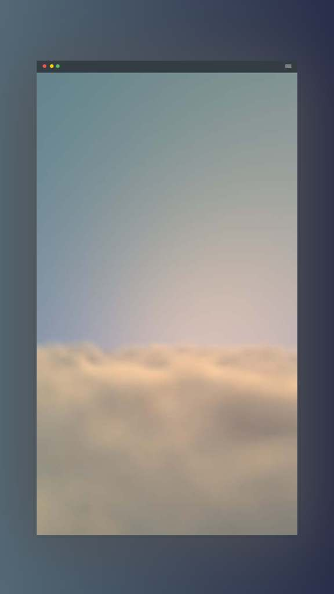
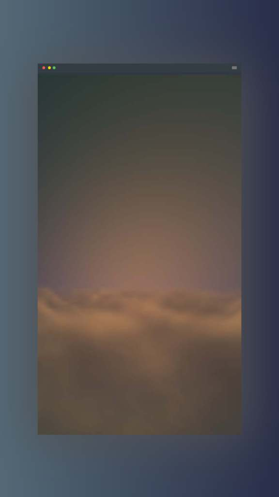

# Atmos XR

<!-- 

  

-->

## Overview

Atmos XR is a mesmerizing Android live wallpaper that brings a dynamic, ever-changing sky to your device. This wallpaper features lifelike 3D clouds that shift in color throughout the day, responding to the natural rhythms of time, giving you the surreal experience of holding clouds in your hand.

## Screenshots

  
  

## Features

Dynamic 3D Clouds:
Experience realistic cloud formations rendered using Three.js and advanced WebGL techniques. Each cloud floats with a natural, fluid motion that brings the sky to life.

Time-Based Color Transitions:
The clouds change their colors gradually throughout the day. From the deep hues of midnight to the soft tones of dawn and the brilliant blues of midday, the wallpaper adapts to reflect the time of day, creating an immersive and calming visual experience.

Effortless Beauty:
Designed to be minimalistic and captivating, this live wallpaper transforms your device into a window to the sky. Watch as the clouds drift by, and feel the surreal sensation of grasping a piece of the heavens.

---

## Inspiration

The idea for this live wallpaper was born from a moment of quiet reflection—a time when I found myself gazing at the clouds, mesmerized by their delicate, ever-changing forms. In that instant, I wondered what it would be like to capture that beauty and bring it with me wherever I go.

Imagine being able to hold the sky in your hand: the soft, billowing clouds, the gentle shift of colors as the day progresses, and the peaceful ambiance they create. This project is my attempt to translate that ethereal feeling into a digital experience. It’s about more than just aesthetics; it’s about bringing a slice of nature’s magic into the palm of your hand, reminding you that even on the busiest days, there’s beauty overhead.

---

Future Work

At present, this project is a Work In Progress. There are many exciting enhancements planned, including further optimization for battery life, additional dynamic weather effects, and deeper customization options. Your feedback is welcome as we continue to refine and expand this digital sky.

---

Thank you for exploring the magic of 3D Realistic Clouds. May your days be as dynamic and awe-inspiring as the ever-changing sky above.

<!--

If you are using the app, don't forget to leave a star ⭐ here on github and let me know your suggestions! -->